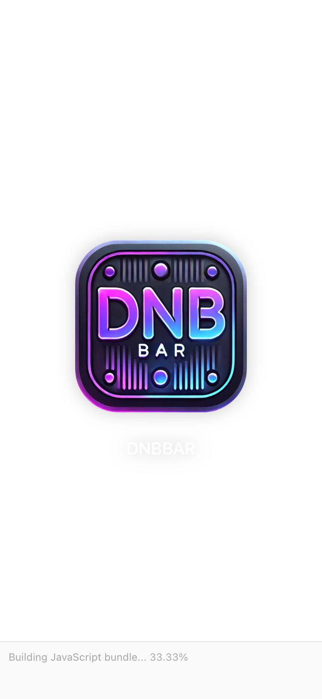
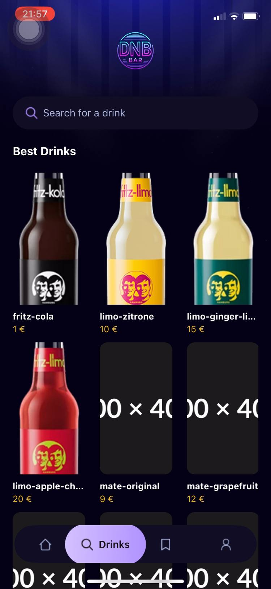
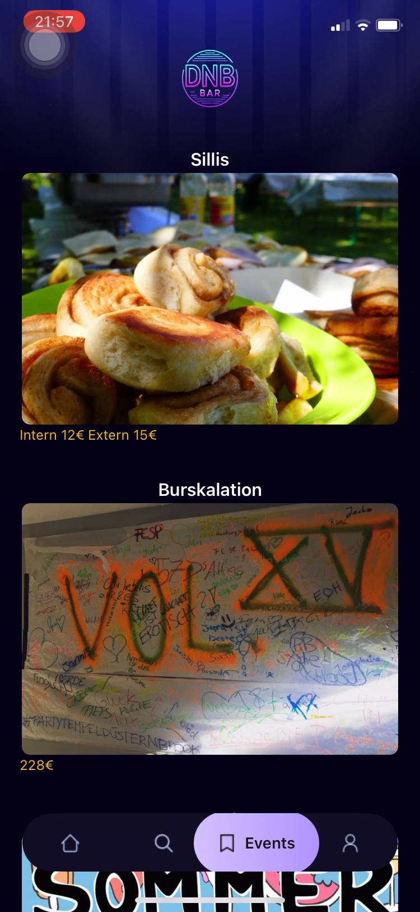
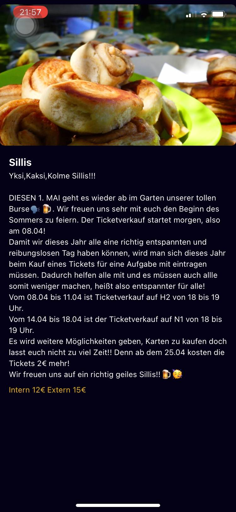
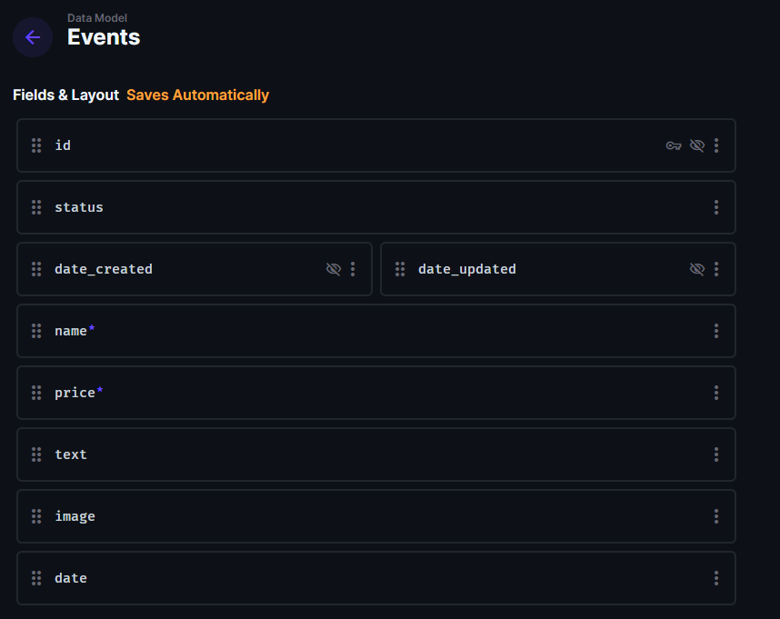

# DNBBar

**DNBBar** is a mobile application built with **React Native (Expo)** for a **student dormitory bar**.  
The app allows students to view **upcoming events**, **latest news**, and **the list of available drinks** with their **prices and descriptions**.

It’s designed to bring the community closer — helping students stay informed about what’s happening, what drinks are available, and when the next party starts.

---

## Features

- **News** – Stay updated with announcements and bar activities.
- **Events** – View upcoming parties and gatherings with detailed info.
- **Drinks** – Explore the drink menu with images, names, and prices.
- **Dynamic content** – All data is managed through a Directus backend and loaded dynamically.
- **Cross-platform** – Built with React Native and Expo, works on both Android and iOS.

---

## Tech Stack

- **Frontend:** React Native (Expo, TypeScript)
- **Backend:** Directus (headless CMS and REST API)
- **Styling:** Tailwind CSS / NativeWind
- **Routing:** Expo Router
- **State Management:** React Hooks
- **Platform:** Android & iOS

---

## Screenshots

| Screen             | Description                                  | Image                                        |
| :----------------- | :------------------------------------------- | :------------------------------------------- |
| **Loading Screen** | App startup logo screen                      |  |
| **Drinks Page**    | Displays the list of drinks and their prices |           |
| **Events Page**    | List of upcoming bar events with images      |           |
| **Event Detail**   | Full event description with pricing and date |      |
| **Add Event**      | Admin interface for adding/editing events    |     |
| **News Page**      | Bar news and updates feed                    |               |

---

## Getting Started

1. **Install dependencies**

   ```bash
   npm install
   ```

1. **Start the app**
   ```bash
   npx expo start
   ```
